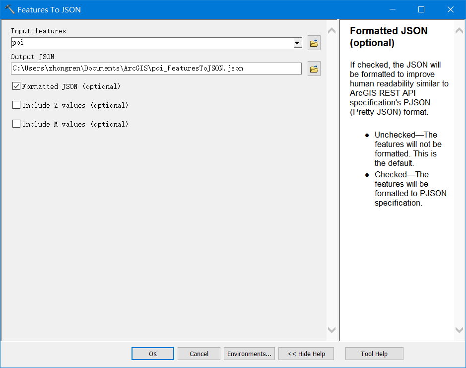

#  ArcGIS for Server VS MongoDb
## 目录
1. 总体效果展示
2. JSON数据生产
3. JSON导入MongoDb
4. Node+Express+Bootstrap
5. 运行
6. 结论

***

### 1.总体效果展示


### 2.JSON数据生产
###### 2.1 数据
    数据如下图：兰州市POI点


###### 2.2转换为JSON
    使用ArcGIS提供的Features to JSON工具进行转换


### 3.JSON导入MongoDb
######  3.1 导入MongoDb
    用Node.js编写Node.js读取JSON文件并将其按照要素格式存入MongoDb中
```javascript
 //features 表创建及document插入
db.createCollection('features', {safe: true}, function(err, collection){
    if(err){
        throw err;
    }else {
        jsonObj.features.forEach(function(value, key){
            var temp= {key: value};
            collection.insert(temp, {safe: true}, function(err, result){
                console.log(result);
            });
            temp= null;
        });

    }
});
```
###### 3.2 MongoDb中显示
    在MongoDb中插入后，查询所有数据显示如下：


### 4.Node+Express+Bootstrap
###### 4.1 项目结构

###### 4.2 页面部分
```html
<body>
  <nav class="navbar navbar-default navbar-fixed-top" role="navigation">
    <div class="navbar-header">
        <a class="navbar-brand" href="#">AGS Server vs MongoDB</a>
    </div>
    <div>
        <p class="navbar-text navbar-right">Signed in as
          <a href="#" class="navbar-link">Thomas</a>
        </p>
    </div>
  </nav>
  <div class="container-fluid">
  <h1 class="center"><%= Servertitle %> vs <%= MongoDBTitle%></h1>
  <h4 class="center">本例针对有59003个兰州市的POI点的要素数据进行属性和空间查询性能对比</h4>
  <h4 class="center"> Tested by 谷中仁 </h4>
    <div class="row">
      <!-----------------------------属性查询对比部分--------------------->
      <div class="col-md-12">
        <h1 class="center">属性查询</h1>
        <table id="serverTable" class="table table-striped table-bordered table-hover table-condensed">
          <caption>对随机要素
            <select id="poiInfo" class="selectpicker" data-style="btn btn-success">
              <option value="鸿运旅馆(兰州雁滩路店)">鸿运旅馆(兰州雁滩路店)</option>
              <option value="双裕牛肉拉面全国连锁">双裕牛肉拉面全国连锁</option>
              <option value="旋子清真寺(西南门)">旋子清真寺(西南门)</option>
              <option value="兰州大学榆中校区办公楼">兰州大学榆中校区办公楼</option>
              <option value="北灵观真武殿">北灵观真武殿</option>
              <option value="秦王川">秦王川</option>
              <option value="兰州汇昌物资石化有限公司(安宁区店)">兰州汇昌物资石化有限公司(安宁区店)</option>
              <option value="视康眼镜(中共金崖镇纪律检查委员会西)">视康眼镜(中共金崖镇纪律检查委员会西)</option>
              <option value="中国人民财产保险有限公司">中国人民财产保险有限公司</option>
              <option value="小西湖新华厂家属院92㎡">小西湖新华厂家属院92㎡</option>
              <option value="榆中邮政局麻家寺储蓄所">榆中邮政局麻家寺储蓄所</option>
              <option value="兰州石化公司离岗退养职工活动中心">兰州石化公司离岗退养职工活动中心</option>
              <option value="兰塑塑业有限责任公司医务所">兰塑塑业有限责任公司医务所</option>
              <option value="兰州市西固区安监局">兰州市西固区安监局</option>
              <option value="兰州万达文华酒店">兰州万达文华酒店</option>
            </select>
            进行测试;<h3 class="focused">一般结论：属性查询方面，MongoDb完胜AGS Server</h3></caption>
          <thread>
            <tr>
              <th>序号</th>
              <th>所选数据</th>
              <th>Server开始时间</th>
              <th>Server结束时间</th>
              <th>Server耗时(ms)</th>
              <th>MongoDB开始时间</th>
              <th>MongoDB结束时间</th>
              <th>MongoDB耗时(ms)</th>
              <th class="focused">MongoDB-Server时差（ms）</th>
            </tr>
          </thread>
          <tbody id="attr">

          </tbody>
        </table>
      </div>

      <!-------------------------------------------------空间查询部分 ------------------------------->
      <div class="col-md-12">
          <h1 class="center">空间查询</h1>
          <div id="map"></div>
          <table id="spatialTable" class="table table-striped table-bordered table-hover table-condensed">
              <caption>
                  <h5>随机点半径100m查询；黑圈代表MongoDb查询结果，粉红色实心圆代表AGS Server查询结果。</h5>
                  <h5 class="focused">因为MongoDb查询单位是mile，转换为meter有误差，所以MongoDb查询结果较AGS Server少</h5>
                  <h3 class="focused">一般结论：空间查询方面，Server更甚一筹</h3>
              </caption>
              <thread>
                  <tr>
                      <th>序号</th>
                      <th>Server开始时间</th>
                      <th>Server结束时间</th>
                      <th>Server耗时(ms)</th>
                      <th>Server查询结果数</th>
                      <th>MongoDB开始时间</th>
                      <th>MongoDB结束时间</th>
                      <th>MongoDB耗时(ms)</th>
                      <th>MongoDb查询结果数</th>
                      <th class="focused">MongoDB-Server时差（ms）</th>
                      <th class="focused">MongoDb-Server结果数（个）</th>
                  </tr>
              </thread>
          <tbody id="spatialAttr">
          </tbody>
        </table>
      </div>
    </div>
  </div>
</body>
```
##### 4.3 REST接口设计
```javascript
router.get('/getInfoByName', function(req, res, next){

    queryByName(req.query.name).then(function(data){
        res.send(data);
    }, function(err){
        res.send(err);
    });
});

/**
 * 查询某点范围某多少距离范围内含有的点
 * localhost:3000/getNear?x=104&y=36&distance=2
 * @param {Number}  x   经度
 * @param {Number}  y   纬度
 * @param {Number}  distance    距离
 * @return {json}  
 */
router.get("/getNear", function(req, res, next){
    //转换单位

    var x= parseFloat(req.query.x);
    var y= parseFloat(req.query.y);
    //1 英里 = 5 280 英尺 = 63 360 英寸 = 1 609.344 米 = 1760 码 = 1.609344千 米=1.609344公里
    var distance= parseFloat(req.query.distance/ 160900.344);//
    findNearLocations(x, y, parseFloat(distance)).then(data=>{
        res.send(data);
    }, err=>{
        res.send(err);
    })
});
```
###### 4.4 计时设计
```javascript
map.on("click", function(evt){
    //server开始时间
    serverStartTime = new Date();
    j++;//序号
    clickPoint = {"x": evt.mapPoint.getLongitude(),
                  "y": evt.mapPoint.getLatitude()};
  circle = new Circle({
    center: evt.mapPoint,
    geodesic: true,
    radius: 100
    // radiusUnit: "esriMiles"
  });
  map.graphics.clear();
  map.infoWindow.hide();
  var graphic = new Graphic(circle, circleSymb);
  map.graphics.add(graphic);
  var query = new Query();
  query.geometry = circle.getExtent();
  featureLayer.queryFeatures(query, selectInBuffer);
});
function selectInBuffer(response){
    serverEndTime = new Date();
    serverTimeSpan = serverEndTime - serverStartTime;
    serverCount = response.features.length;
    mongoStartTime = new Date();
     //===================================MongoDb开始===================================
     var url = "http://localhost:3000/getNear";
     var data = {
        "x" : clickPoint.x,
        "y" : clickPoint.y,
        "distance" : 100
    };
    $.get(url, data, function(response, status){
        mongoEndTime = new Date();
        mongoTimeSpan = mongoEndTime - mongoStartTime;
        mongoCount = response.result.length;
        console.log(response);
        var mongoSymbol = new SimpleMarkerSymbol();
        var infoTemplate = new InfoTemplate("MongoDb结果","MongoDb结果")
        if(response.result.length> 0){
            for(var index in response.result){
                var mongoPoint = new Point([response.result[index].key.geometry.x, response.result[index].key.geometry.y]);
                var graphic= new Graphic(mongoPoint, mongoSymbol, null, infoTemplate);
                map.graphics.add(graphic);
                graphic = null;
            }
        }
        var mongoVsServerTime= mongoTimeSpan- serverTimeSpan;
        var mongVsServerCount= mongoCount - serverCount;
        //控制显示
        var html = '';
        html +='<tr>';
        html +='<td>'+ j +'</td>';
        html +='<td>'+ serverStartTime.toLocaleTimeString() +'</td>';
        html +='<td>'+ serverEndTime.toLocaleTimeString() +'</td>';
        html +='<td>'+ serverTimeSpan +'</td>';
        html +='<td>'+ serverCount +'</td>';
        html +='<td>'+ mongoStartTime.toLocaleTimeString() +'</td>';
        html +='<td>'+ mongoEndTime.toLocaleTimeString() +'</td>';
        html +='<td>'+ mongoTimeSpan +'</td>';
        html +='<td>'+ mongoCount +'</td>';
        html +='<td class="focused">'+ mongoVsServerTime +'</td>';
        html +='<td class="focused">'+ mongVsServerCount +'</td>';
        html +='</tr>';
        domConstruct.place(html, "spatialAttr", "last");
        html =null;
    });
```
### 5.运行
    在CMD中进入项目目录
```shell
> cd  ~/.ServerVsMongoDb
> node bin/www
```
    打开浏览器进入localhost:3000，效果在最前面......

### 6.总结
    从最上面的gif图中可以看出，对于5W条数据，属性查询方面MongoDb比ArcGIS for
    Server 的查询速度快；而空间查询方面，ArcGIS for Server较快。因为MongoDb
    空间查询使用的是mile，在转换为meter的过程中会有误差，所以MongoDb的查询结
    果会少于Server的查询数量。

    但是，MongoDb对数据不能分析，空间数据的价值就在于空间分析，让数据说话，而
    不是仅仅让数据只用于存储数据。

    对于MongoDb更适合于做LBS应用，可以利用MongoDb和一些开源的地图框架就可实现
    GIS数据上图；对于ArcGIS for Server，其主要优势是空间查询和空间分析，对于
    有强GIS需求的项目则是一种更好的选择。

    MonogoDB使用简单、安全性高，性能优越，现在，很多应用系统都采用了MongoDB作
    为数据库，由此实现可实现文件存储系统、大数据解决方案、智能打车关键业务等等，
    MonogoDB受到越来越多的人和企业的欢迎。

关于此文更早的信息详见[MongoDb与ArcGIS for Server属性查询与空间查询-前期](http://mp.weixin.qq.com/s?__biz=MzI3ODM2ODU0Mw==&mid=2247483687&idx=1&sn=a3925b800c64f8665e7a08b8b585d93b&scene=4#wechat_redirect)
